<a href="https://github.com/uni-helper/highlight/stargazers"></a>
<a href="https://www.npmjs.com/package/@uni-helper/highlight"></a>
<a href="https://www.npmjs.com/package/@uni-helper/highlight"></a>
<br/>

基于 [sugar-high](https://github.com/huozhi/sugar-high) 的 [uni-app](https://uniapp.dcloud.net.cn/) 轻量级代码高亮组件。

支持小程序、H5 和 App（vue）。组件使用内联样式渲染纯 `<view>`/`<text>` 节点，不依赖 DOM、不使用 `rich-text`，也没有运行时渲染函数（小程序不支持）。

## 特性

- ⚡️ 轻量：在 sugar-high 基础上 gzip 后约 1.5 kB
- 🗂 内置 30+ 种语言支持：JavaScript/TypeScript、Vue、HTML、CSS、Python、Go、Rust、JSON、Diff、Markdown 等
- 🏷 支持语言别名：`ts`、`tsx`、`js`、`py`、`xml`、`.vue` 等
- 🌗 内置亮色和暗色主题，支持完全自定义主题
- 🔢 可选行号、横向滚动或自动换行、文本可选
- 📦 直接发布原始 SFC，由 uni-app 编译器按平台构建

## 安装

```sh
pnpm add @uni-helper/highlight
```

需要 uni-app Vue 3 项目（`vue >= 3.3`）。

## 使用

```vue
<script setup lang="ts">
import Code from '@uni-helper/highlight'
</script>

<template>
  <Code
    code="const ready = true"
    lang="ts"
  />
</template>
```

或者传入多行代码片段：

```vue
<script setup lang="ts">
import Code from '@uni-helper/highlight'

const snippet = `function greet(name: string) {
  return \`Hello, \${name}!\`
}`
</script>

<template>
  <Code
    :code="snippet"
    lang="ts"
    theme="dark"
    show-line-numbers
  />
</template>
```

### Props

| 属性              | 类型                                           | 默认值    | 说明                                                                                                                   |
| ----------------- | ---------------------------------------------- | --------- | ---------------------------------------------------------------------------------------------------------------------- |
| `code`            | `string`                                       |           | 需要高亮的源代码                                                                                                       |
| `lang`            | `string`                                       |           | 语言名称、别名或扩展名（如 `ts`、`.tsx`、`python`）。未知语言回退到 JavaScript 词法分析器；使用 `plaintext` 可禁用高亮 |
| `theme`           | `'light' \| 'dark' \| Partial<HighlightTheme>` | `'light'` | 主题预设或自定义覆盖项                                                                                                 |
| `showLineNumbers` | `boolean`                                      | `false`   | 渲染行号                                                                                                               |
| `selectable`      | `boolean`                                      | `false`   | 允许文本选择（微信小程序和 H5）                                                                                        |
| `tabSize`         | `number`                                       | `2`       | 制表符展开的空格数                                                                                                     |
| `wrap`            | `boolean`                                      | `false`   | 长行自动换行，而不是横向滚动                                                                                           |

### 主题

内置了 sugar-high 官方的两套配色：

```vue
<Code :code="snippet" theme="dark" />
```

传入部分主题对象即可自定义任意颜色，未指定的颜色回退到亮色主题：

```ts
import { darkTheme } from '@uni-helper/highlight/theme'

const theme = {
  backgroundColor: '#1a1b26',
  colors: {
    keyword: '#bb9af7',
    string: '#9ece6a',
  },
}
```

```vue
<Code :code="snippet" :theme="theme" />
```

主题的结构如下：

```ts
interface HighlightTheme {
  backgroundColor: string
  foreground: string
  /** 每个 token 类型的文本颜色 */
  colors: Partial<Record<TokenType, string>>
  /** 行注释对应的行背景色，例如 `diff-add` */
  lineColors: Record<string, string>
}
```

### 底层 API

主题预设和高亮数据模型可以通过子路径导出使用：

```ts
import { darkTheme, lightTheme, resolveTheme } from '@uni-helper/highlight/theme'
import { tokenizeToLines } from '@uni-helper/highlight/tokenize'

const lines = tokenizeToLines('const a = 1', { lang: 'ts', theme: 'dark' })
// [{ index, value, tokens: [{ type, value, text, color, className }], className, blank, ... }]
```

`text` 字段对小程序是安全的：制表符已展开为空格，连续空格已转换为不换行空格，因为小程序 `<text>` 节点内连续的普通空格会被折叠。

## AI Skills

本包内置了面向 AI 编程助手的 skill（`skills/uni-app-highlight`）。安装本包后运行一次：

```sh
npx skills-npm
```

即可把 skill 链接给你的 agent（`skills-npm` 已声明为本包的 peerDependency，npm 安装时会自动带上）。详见 [skills-npm](https://github.com/antfu/skills-npm)。

## 实现原理

1. sugar-high 将代码解析为逐行 token（不涉及 DOM）。
2. token 类型根据主题解析为对应颜色。
3. 组件每行渲染一个 `<view>`，每个 token 渲染一个 `<text>`，颜色以内联样式呈现。使用内联样式是因为在小程序平台上，页面样式无法可靠地作用到组件内部。

包的入口**就是**原始的 `.vue` 单文件组件。这对小程序很关键：只有当导入直接解析到 `.vue` 文件时，uni-app 编译器才能静态注册组件，因此 `import Code from '@uni-helper/highlight'` 在所有平台开箱即用。渲染的节点上保留了 sugar-high 的语义类名（`sh__line`、`sh__token--keyword` 等），在平台支持的情况下，你可以在其上叠加自己的 CSS。

## 许可证

[MIT](./LICENSE.md) License © [FliPPeDround](https://github.com/FliPPeDround)

## 🙇🏻‍♂️[赞助](https://afdian.com/a/flippedround)

<p align="center">
  <a href="https://afdian.com/a/flippedround">
    
  </a>
</p>
